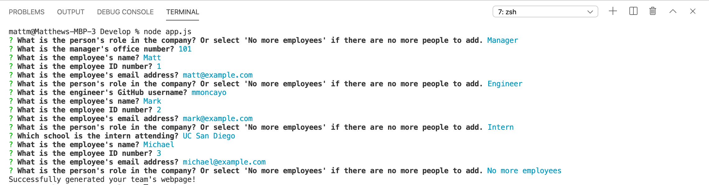
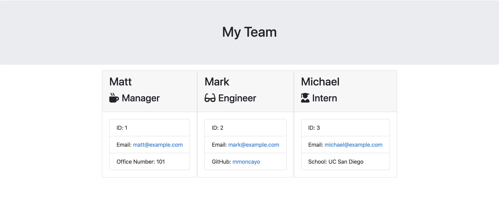

# Team Profile Generator
[](https://github.com/mmoncayo/TeamProfileGenerator/)

Using Node.js, this CLI application will allow you to generate an HTML page with all of your team members (manager, engineers, interns), based on a user input method that will collectively organize all of the profile details related to each member.

## Installation

Use the npm install feature to establish all of the dependencies required to run the program

```bash
npm install
```

## Usage
You can run the formatted tests using jest to ensure that all parameters of the code have been successfully functional to pass through


```javascript
npm run test
```

You can then begin the program on your command line by ensuring first you are on the directory and then writing out the following command

```bash
node app.js
```

## Demonstrations & Illustrations





## Contributing
Pull requests are welcome. For major changes, please open an issue first to discuss what you would like to change.

Please make sure to update tests as appropriate. Positive and contructive feedback is welcomed.

## License
[MIT](https://choosealicense.com/licenses/mit/)